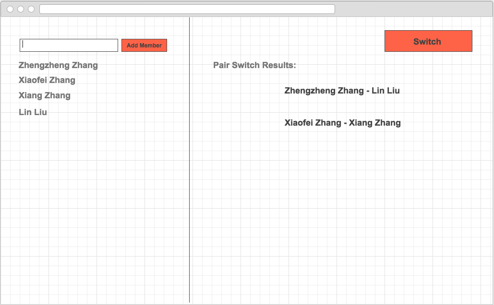

# KOPair

To do a tool for switch pair using KnockoutJS and Bootstrap

### Add members to match another.

1. add a member when input a name and click a button 'Add member'.

1. Display results of pair when click button 'Switch'.

