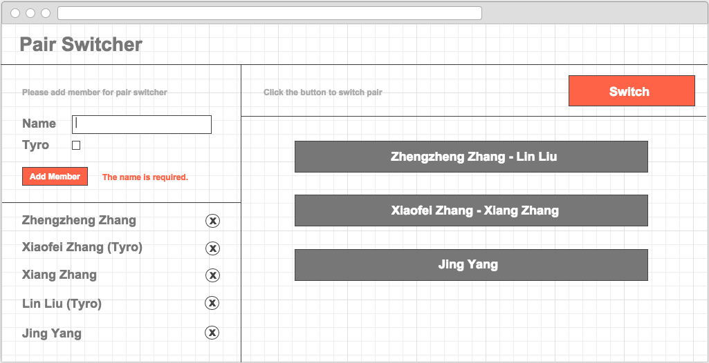

# KOPair

To do a tool for switch pair using KnockoutJS and Bootstrap

## Getting Started

Make sure you have the latest packages installed

```
npm install
bower install
```

Note: If you don't have `npm` installed, make sure you have
[node](http://nodejs.com) installed. If you don't have bower,
`npm install -g bower`.

The above steps will download all the required software to
build and run this app, such as [grunt](http://gruntjs.com),
[requirejs](http://requirejs.org), and [jquery](http://jquery.com).

## Running the server

You can run your app using `grunt serve`. This will start a
server on `http://localhost:9000` and open a browser to this location.

Any modification on the html, css, scss or javascript will be detected
and the page on the browser will be reloaded automatically

If you'd like to run the compiled version (without reloading), run
`grunt serve:dist`.

## Building the application

This application uses requirejs to load the various modules in
the app folder. However, upon build, all of these files are
concatenated and minified together to create a small, compressed
javascript file.

Running `grunt` by itself will run through all of the steps of
linting the javascript, building out dependencies and ultimately
creating all the files in the folder `/dist/`.

## Working with the scaffolded app

There's just enough to in place to get you going. Go ahead
and make your changes to `index.html`. You'll start your
javascript work in `app/assets/js/main.js` by requiring your first
modules. Past that, well, the world is your oyster.

## Deploying your application on a server

Assuming you're already ran `npm install` and `bower install`,
the only pieces required to run the application in its built
state is running `grunt` and copy the files in dist in the 
correct location.


Tasking
---



### Add members for pair.

1. Can input name of member in the input text.

1. Add a name as member on click the button that 'Add member'.

1. Display all added member names below button.

1. A reminder message for add member.

### To match members to switch pair.

1. Calculate pair results on click button that 'Switch'.

1. Display results of pair below the button.

1. A reminder message for switch pair.

### Remove a member.

1. There is a remove icon button after name of member.

1. Remove the name from list on click the remove button.

### Edit member.

1. Read member info from form if click member name, contains name and tyro.

1. The add member button will be 'Save' when edit a member.

1. Update the member info on click save button.

### Auto update results.

1. Once switch pair, update the results automatically if added a member again.

1. Once switch pair, update the results automatically if removed a member.

1. Once switch pair, update the results automatically if edited a member.

### Check name.

1. The member name is required.

1. Display error message if name is empty string when add member.

1. Display error message if remove all string for name.

### Mark tyro member.

1. There is a checkbox for tyro in the form of adding member.

1. Display '(Tyro)' after name if the member have been marked as a tyro which means inexperience.

1. A tyro should not match any tyro or is independent when switch pair.
